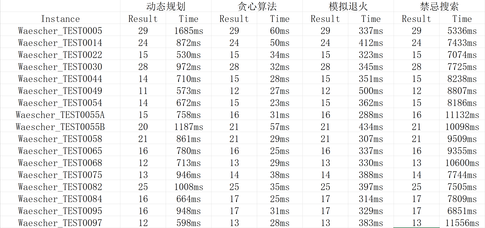

# 算法设计与分析综合项目

**18324061 文君逸**

## 题目描述

装箱问题(BPP)可以用一种非常简单的方式定义。
我们得到了n个物品，每个物品都有一个整数重量w<sub>j</sub>（j=1，…，n），以及无限数量的整数容量的相同箱子。
目的是将所有物品装入最少数量的箱子中，以使任何箱子中装入的总重量不超过容量。本项目不要求求出最优解，但要求求出最优近似解。

### 输入

物品的数量**n**,箱子的容量**c**,每件物品的重量**w<sub>j</sub>**

### 输出

本次题目设计的输出有：
+ 每个箱子装的物品序号
+ 每个箱子的剩余容量
+ 需要的最小箱子数
+ 算法运行时间

## 算法设计

### 动态规划

#### 思路

**一种简单的装箱问题的另一种变式是**：    
给定一个固定容量的箱子，以及n件物品的重量，从这n件物品中选取若干件装入箱子，使得箱子剩余体积最小。    
        
这是一个比较简单的背包问题。我们先来求解这个问题，然后把选出来的这若干件物品去掉，对于剩下的物品再选取若干件装入箱子，使得箱子的剩余体积最小。重复这个求解过程，直到所有的物品都被装入箱子为止。每一次求解问题都会使用一个新的箱子，这样最终需要使用的箱子数是求解问题的次数。

#### 算法分析

**求解结果一定是最优解吗？**            
一定是最优解。每一次求解过程都能让新使用的这个箱子剩余体积最小，即每一次都能使箱子的空间利用率最大化。试想，如果一个箱子的空间利用率不是最大化，那么接下来的一个箱子空间势必要被上一个箱子未安排妥当的空间浪费，结果一定不是最优解。          
但有一点需要十分注意：回溯的时候需要有选择地回溯，尽量先选择大的物品。例如，当箱子的容量为10，此时物品的重量分别为6 6 6 2 2 2 2 2 2，则对于一个箱子，放入一个6，两个2和放入五个2都是可以的，但是回溯的时候必须选择放入一个6和两个2。         
理由很简单，2是小的物品，是便于“塞入”的物品，而算法应当先处理不容易“塞入”的物品。假如先选择小的物品，结果会变成
``` 
箱子1: 2 2 2 2 2
箱子2: 6 2
箱子3: 6
箱子4: 6
```
而如果先选择大的物品，结果会变成
```
箱子1: 6 2 2
箱子2: 6 2 2
箱子3: 6 2 2
```
这是十分需要注意的一点，不然有可能动态规划的结果比贪心算法还差。          

            
**算法时间复杂度如何？**             
首先我们分析一下求解过程和找到哪些物品被选出的过程。              
求解过程：
``` C++
/*求解箱子最多能放入多少重量的物品的过程*/
for (i = 1; i <= num; i++) {
	for (j = 1; j <= capacity; j++) {
		if (j < item[i] || item[i] == -1) {
			dp[i][j] = dp[i - 1][j];//放不下第i件物品或者第i件物品已经被用过
		}
		else {
			/*对于要不要放入第i件物品进行选择
			  若放入，问题变成在前i-1件物品中利用j-item[i]的空间所能装入的最大重量      
			  若不放入，问题变成在前i-1件物品中利用j的空间所能装入的最大重量 
			*/
			dp[i][j] = max(dp[i - 1][j], dp[i - 1][j - item[i]] + item[i]);
			
		}

	}
			
}
```
         

回溯过程：
``` C++
int temp = dp[num][capacity], loc = num, sum = 0;

while (temp != 0) {
	/*
	逆序循环的原因是因为在求解过程中为正向循环
	如果第i件物品被选择，则无需考虑i+1及之后的物品
	从前i-1件物品中继续找哪些物品被选择即可
	*/
	for (i = loc; i >= 1; i--) {
		//找到哪一件物品被选择
		if (item[i] != -1 && temp - item[i] >= 0 && dp[i - 1][temp - item[i]] == dp[i][temp] - item[i]) {
			printf("%d ", i);
			load_num++;
			temp = temp - item[i];
			sum += item[i];		//加和本次求解选出的物品重量，与结果校验
			item[i] = -1;
			loc = i - 1;
			break;
		}
	}

}

assert(sum == dp[num][capacity]);	//防止回溯过程出错
```

以上是每一次求解过程都要经历的两个过程，其中求解过程的时间复杂度为 ***O(num\*capacity)*** ，其中 **num** 是物品的数量，**capacity**是箱子的最大容量。回溯过程的时间复杂度为 **O(num)** 。而根据输入的物品重量的不同，求解次数是不同的，因此求解的次数与算法的输入有关。

### 贪心算法

由于本次项目只要求近似解，我们可以利用贪心算法，在略微牺牲最优解的情况下追求时间效率。

#### 思路

贪心算法需要先将物品的重量**按从大到小排序**，对于每一件物品，从已经使用的第一个箱子开始遍历：
+ 如果发现这个物品可以装入箱子，那么就装入，并把对应的箱子剩余容量减去物品的重量
+ 如果对于所有已经使用的箱子都无法装入，那么新使用一个新的箱子，把新箱子容量减去物品的重量，并将已经使用的箱子数加1。

``` C++
for (i = 1; i <= num; i++) {
	for (j = 1; j <= result; j++) {
		if (capacity - bin[j] >= item[i]) {
			bin[j] += item[i];
			rec[j].r[++rec[j].num] = i;
			break;
		}
	}

	if (j > result) {
		bin[++result] += item[i];
		rec[result].r[++rec[result].num] = i;
	}
}
```

#### 算法分析

**为什么要把物品重量从大到小排序？**    
目的是为了让每个箱子的剩余空间尽量小。
+ 如果一个大物品可以恰好或勉强装入一个箱子的话，如果换装一个小物品的话，一定会使这个箱子的剩余未利用空间比装入大箱子多
+ 而把这个大物品装入后面本应装小物品的箱子会压缩本应装小物品箱子的剩余空间，从而使这个本能装下其他物品的箱子装不下其他物品造成空间浪费。

贪心算法隐含的启发函数是在所有能装入当前物品的箱子中选择能使箱子剩余体积最小的那个箱子。因为所有的箱子已经事先从大到小排序，所以第一个能装下当前物品的箱子的剩余空间将是最小的。

**为什么可能不是最优解？**       
没有考虑到两个或多个小物品重量相加后可能比一件大物品更适合放入箱子。    
例如：一个箱子有6个单位的剩余空间，此时剩下的物品重量为**5 2 2 2**, 按照贪心算法，第一个重量为5的物品会被装入，但实际上装入后面3个重量为2的物品是更优的选择。在后面的算法对比中我们便会看到这一点。      

**算法时间复杂度如何？**    
最坏情况下，每一个箱子都恰好只能装下一个物品，那么时间复杂度为 ***O(num<sup>2</sup>)*** ,因为此时对于每一个物品都需要遍历到最后一个箱子发现装不下，并新使用一个新的箱子。这相比于动态规划的时间复杂度已经优化了很多，但牺牲的是解的最优性。

### 模拟退火算法

#### 思路

贪心算法的从大到小排序只是我们逻辑上的最优解情况，而实际上，如果物品的排列恰好是按照动态规划中最优解的排列，那么再利用贪心算法求解便可得到最优解。物品的排列方式成为了我们搜索的对象。        
我们初始化贪心算法得到的解为当前最优解。对于每一次求解过程，首先记录当前物品的排列，然后随机对物品进行若干次交换：
+ 如果交换后的排列方式所用的箱子更少或者一样多，那么更新当前解，并将当前物品的排列方式保留
+ 如果交换后的排列方式所用的箱子更多，根据模拟退火算法的规则，将设置一个概率来决定是否接受当前物品的排列方式以及当前解。如果不接受，则放弃这一次交换，即把物品的排列恢复到交换之前的状态。

``` C++
while (current_tem >= MIN_TEM) {
	save();			//记录当前排列状态
	rand_swap();	//随机交换
	first_fit();	//贪心算法
	dE = result - best_result;

	if (dE <= 0) {
		best_result = result;
	}
	else if (exp(-dE / (current_tem * k)) > random(0.0, 1.0)) {//有一定概率接受较差解
		best_result = result;	
	}
	else {
		back();		//放弃交换后的排列状态
	}

	current_tem = cold_speed * current_tem;	//降温
}
```

#### 算法分析

**算法的时间复杂度如何？**        
与所选的降温速度和初始温度有关。每一次贪心求解的过程都和贪心算法复杂度一样，变化只是求解的次数。             

### 禁忌搜索

#### 思路

和模拟退火算法一样，禁忌搜索同样是把物品的排列顺序作为搜索对象，但不同点在于交换物品的操作上。根据禁忌搜索的规则，近期搜索过的状态不能重复出现，因此在算法设计上我们改为近期移动的物品不能再次移动，即每一次移动的时候都尽量移动不同的物品，使得状态尽可能多元化，这样也更加有可能接近最优解。

``` C++
for (i = 1; i <= num; i++) {
	if (cnt[i] != 0) {
		cnt[i] = (cnt[i] + 1) % 3;
	}
}

for (i = 1; i <= num / 5; i++) {
	pos1 = rand() % num + 1;
	pos2 = rand() % num + 1;

	if (pos1 != pos2 && cnt[pos1] == 0 && cnt[pos2] == 0) {
		swap(item[pos1], item[pos2]);
		cnt[pos1] = cnt[pos2] = 1;
	}
	else {
		--i;
	}
}
```

我们交换其中1/5的物品，同时规定已经交换过的物品在接下来的两轮中都不能再次参与交换，这样就保证了状态的多元化。而求解最少箱子的时候重复使用贪心算法即可。

#### 算法分析

**算法的时间复杂度如何？**        
与选择的迭代次数有关有关。贪心算法的时间复杂度为 ***O(num<sup>2</sup>)*** ，禁忌搜索只需要再乘以对应的迭代次数即可。

## 算法比较


从结果的最优性上来说，动态规划的结果优于其他三种算法；从时间上来说，贪心算法的运行时间最短，这与我们之前的分析是一致的。模拟退火、禁忌搜索一开始的初始化最优解为贪心算法得到的解，理论上在迭代次数足够多的情况下可以搜索到动态规划所对应的物品排列顺序，但可能由于测试数据的原因，即使是贪心算法求出来的解只比最优解多用一个箱子，也就是动态规划对应的物品排列方式是非常苛刻的，因此两种启发式算法都没有在本次实验中得到动态规划的最优解。             
总的来说，如果数据再大一点或者强一点，动态规划会在花费时间较长的情况下求出最优解，而贪心算法会在花费极短时间的情况下求出一个逻辑上的最优近似解，而启发式算法由于时间复杂度根据迭代次数，所以有可能运行时间比动态规划长，但求出的解理论上位于贪心算法与动态规划之间。            
对于本次实验所用的测试数据，选择贪心算法是最优的，因为贪心算法能在极短时间内算出答案，并且保证解最多比真正的最优解多用一个箱子，这对于现实实践也是可以接受的。而对于强一点的数据，则应选择用启发式算法，因为动态规划的复杂度是 **求解次数** * ***O(num\*capacity)*** ，求解次数由每一次选出的物品数量决定，而启发式算法的求解复杂度与箱子容量无关，而求解次数可以根据要求解的可接受范围自行调整。在时间允许的情况下，可以利用动态规划算法牺牲时间来求出最优解。

## 附录: 源代码

### 动态规划

``` C++
#include <iostream>
#include <cstdio>
#include <cstring>
#include <algorithm>
#include <assert.h>
#include <ctime>
#include <cmath>
using namespace std;

#define SIZE 1005
#define MAX_CAPACITY 100005

int dp[SIZE][MAX_CAPACITY], item[SIZE], nxt[MAX_CAPACITY], current[MAX_CAPACITY];
int num, capacity, result = 0, i, j, load_num = 0;

bool comp(int x, int y) {
	return x > y;
}

void print() {
	int temp = dp[num][capacity], loc = num, sum = 0;
	printf("bin %d loads: ", result);

	while (temp != 0) {
		for (i = loc; i >= 1; i--) {
			if (item[i] != -1 && temp - item[i] >= 0 && dp[i - 1][temp - item[i]] == dp[i][temp] - item[i]) {
				printf("%d ", i);
				load_num++;
				temp = temp - item[i];
				sum += item[i];
				item[i] = -1;
				loc = i - 1;
				break;
			}
		}

		if (i > num) {
			break;
		}
	}

	assert(sum == dp[num][capacity]);	//防止回溯出错
	printf("\nbin %d space left:%d\n\n", result, capacity - dp[num][capacity]);
	

}

int main() {

	scanf("%d%d", &num, &capacity);
	for (i = 1; i <= num; i++) {
		scanf("%d", &item[i]);
	}

	sort(item + 1, item + 1 + num);

	clock_t time_start = clock();
	while (load_num < num) {
		result++;
		memset(dp, 0, sizeof(dp));

		for (i = 1; i <= num; i++) {
			for (j = 1; j <= capacity; j++) {
				if (j < item[i] || item[i] == -1) {
					dp[i][j] = dp[i - 1][j];
				}
				else {
					dp[i][j] = max(dp[i - 1][j], dp[i - 1][j - item[i]] + item[i]);
				}

			}
			
		}

		print();
	}

	printf("result: %d\n", result);
	clock_t time_end = clock();
	cout << "time use: " << 1000 * (time_end - time_start) / (double)CLOCKS_PER_SEC << "ms" << endl;
	return 0;
}
```

### 贪心算法

``` C++
#include <iostream>
#include <cstdio>
#include <cstring>
#include <algorithm>
#include <ctime>
using namespace std;

#define SIZE 10005

int bin[SIZE] = { 0 }, item[SIZE];
int num, capacity, result = 0, i, j;

typedef struct record {
	int num, r[SIZE];
	record() : num(0) {}
}Record;

Record rec[SIZE];

bool comp(int x, int y) {
	return x > y;
}

void print() {
	
	for (i = 1; i <= result; i++) {
		printf("bin %d loads: ", i);
		for (j = 1; j <= rec[i].num; j++) {
			printf("%d ", rec[i].r[j]);
		}
		printf("\nbin %d space left:%d\n\n", i, capacity - bin[i]);
	}

	printf("\nresult: %d\n", result);
}

int main() {
	scanf("%d%d", &num, &capacity);
	for (i = 1; i <= num; i++) {
		scanf("%d", &item[i]);
	}

	clock_t time_start = clock();
	sort(item + 1, item + 1 + num, comp);

	for (i = 1; i <= num; i++) {
		for (j = 1; j <= result; j++) {
			if (capacity - bin[j] >= item[i]) {
				bin[j] += item[i];
				rec[j].r[++rec[j].num] = i;
				break;
			}
		}

		if (j > result) {
			bin[++result] += item[i];
			rec[result].r[++rec[result].num] = i;
		}
	}

	print();
	clock_t time_end = clock();
	cout << "time use: " << 1000 * (time_end - time_start) / (double)CLOCKS_PER_SEC << "ms" << endl;

	return 0;
}
```

### 模拟退火

``` C++
#include <iostream>
#include <cstdio>
#include <ctime>
#include <algorithm>
using namespace std;

#define INIT_TEM 100.0
#define MIN_TEM 0.1
#define cold_speed 0.97
#define k 0.01
#define SIZE 10005
#define SWAP_NUM 1000

int bin[SIZE] = { 0 }, item[SIZE], temp[SIZE];
int num, capacity, result = 0, i, j, best_result;
double current_tem;

typedef struct record {
	int num, r[SIZE];
	record() : num(0) {}
}Record;

Record rec[SIZE];

bool comp(int x, int y) {
	return x > y;
}

void print() {

	for (i = 1; i <= result; i++) {
		printf("bin %d loads: ", i);
		for (j = 1; j <= rec[i].num; j++) {
			printf("%d ", rec[i].r[j]);
		}
		printf("\nbin %d space left:%d\n\n", i, capacity - bin[i]);
	}

	printf("\nresult: %d\n", result);
}

void first_fit() {
	result = 0;
	memset(bin, 0, sizeof(bin));

	for (i = 1; i <= num; i++) {
		for (j = 1; j <= result; j++) {
			if (capacity - bin[j] >= item[i]) {
				bin[j] += item[i];
				rec[j].r[++rec[j].num] = i;
				break;
			}
		}

		if (j > result) {
			bin[++result] += item[i];
			rec[result].r[++rec[result].num] = i;
		}
	}

	//print();
}

void save() {
	for (i = 1; i <= num; i++) {
		temp[i] = item[i];
	}
}

void back() {
	for (i = 1; i <= num; i++) {
		item[i] = temp[i];
	}
}

void rand_swap() {
	int pos1, pos2;

	for (i = 1; i <= SWAP_NUM; i++) {
		pos1 = rand() % num + 1;
		pos2 = rand() % num + 1;

		if (pos1 != pos2) {
			swap(item[pos1], item[pos2]);
		}
	}

}

double random(double dblow, double dbhigh)//产生dblow-dbhigh之间随机数
{
	double dbtemp = rand() / ((double)RAND_MAX + 1.0);
	return dblow + dbtemp * (dbhigh - dblow);
}


int main() {
	int dE, before, total = 0;
	
	scanf("%d%d", &num, &capacity);
	for (i = 1; i <= num; i++) {
		scanf("%d", &item[i]);
	}

	clock_t time_start = clock();
	srand((unsigned)(time(NULL)));
	current_tem = INIT_TEM;

	sort(item + 1, item + 1 + num, comp);

	first_fit();
	best_result = result;
	before = best_result;

	printf("Initial best result: %d\n\n", result);

	while (current_tem >= MIN_TEM) {
		save();
		rand_swap();
		first_fit();
		dE = result - best_result;

		printf("Iteration %d:\ntem: %.2lf\nresult: %d\n\n",++total, current_tem, result);

		if (dE <= 0) {
			best_result = result;
		}
		else if (exp(-dE / (current_tem * k)) > random(0.0, 1.0)) {
			best_result = result;
		}
		else {
			back();
		}

		current_tem = cold_speed * current_tem;
	}

	printf("\nbefore SA result: %d\nafter SA result: %d\n", before, best_result);
	clock_t time_end = clock();
	cout << "time use: " << 1000 * (time_end - time_start) / (double)CLOCKS_PER_SEC << "ms" << endl;
}
```

### 禁忌搜索

``` C++
#include <iostream>
#include <cstdio>
#include <ctime>
#include <algorithm>
using namespace std;

#define SIZE 10005
#define SWAP_NUM 1000

int bin[SIZE] = { 0 }, item[SIZE], temp[SIZE], cnt[SIZE] = { 0 };
int num, capacity, result = 0, i, j, best_result;
double current_tem;

typedef struct record {
	int num, r[SIZE];
	record() : num(0) {}
}Record;

Record rec[SIZE];

bool comp(int x, int y) {
	return x > y;
}

void print() {

	for (i = 1; i <= result; i++) {
		printf("bin %d loads: ", i);
		for (j = 1; j <= rec[i].num; j++) {
			printf("%d ", rec[i].r[j]);
		}
		printf("\nbin %d space left:%d\n\n", i, capacity - bin[i]);
	}

	printf("\nresult: %d\n", result);
}

void first_fit() {
	result = 0;
	memset(bin, 0, sizeof(bin));

	for (i = 1; i <= num; i++) {
		for (j = 1; j <= result; j++) {
			if (capacity - bin[j] >= item[i]) {
				bin[j] += item[i];
				rec[j].r[++rec[j].num] = i;
				break;
			}
		}

		if (j > result) {
			bin[++result] += item[i];
			rec[result].r[++rec[result].num] = i;
		}
	}

	//print();
}

void save() {
	for (i = 1; i <= num; i++) {
		temp[i] = item[i];
	}
}

void back() {
	for (i = 1; i <= num; i++) {
		item[i] = temp[i];
	}
}

void rand_swap() {
	int pos1, pos2;

	for (i = 1; i <= num; i++) {
		if (cnt[i] != 0) {
			cnt[i] = (cnt[i] + 1) % 3;
		}
	}

	for (i = 1; i <= num / 5; i++) {
		pos1 = rand() % num + 1;
		pos2 = rand() % num + 1;

		if (pos1 != pos2 && cnt[pos1] == 0 && cnt[pos2] == 0) {
			swap(item[pos1], item[pos2]);
			cnt[pos1] = cnt[pos2] = 1;
		}
		else {
			--i;
		}
	}

}

double random(double dblow, double dbhigh)//产生dblow-dbhigh之间随机数
{
	double dbtemp = rand() / ((double)RAND_MAX + 1.0);
	return dblow + dbtemp * (dbhigh - dblow);
}


int main() {
	int dE, before, total = 0;

	scanf("%d%d", &num, &capacity);
	for (i = 1; i <= num; i++) {
		scanf("%d", &item[i]);
	}

	clock_t time_start = clock();
	srand((unsigned)(time(NULL)));

	sort(item + 1, item + 1 + num, comp);

	first_fit();
	best_result = result;
	before = best_result;

	printf("Initial best result: %d\n\n", result);

	while (total <= 10000) {
		save();
		rand_swap();
		first_fit();
		dE = result - best_result;

		printf("Iteration %d:\nresult: %d\n\n", ++total, result);

		if (dE <= 0) {
			best_result = result;
		}
		else {
			back();
		}

	}

	printf("\nbefore TS result: %d\nafter TS result: %d\n", before, best_result);
	clock_t time_end = clock();
	cout << "time use: " << 1000 * (time_end - time_start) / (double)CLOCKS_PER_SEC << "ms" << endl;
}
```